# FawaryTask-FullStack
 

## 1. Assumptions:
  <ol>
     <li>Shippable products only has weight fees</li>
     <li>Shippable products with different weights are considered different items</li>
  </ol>
   

## 2. UML:
  <ul>
     <b><li>UML Class Diagram Describe System Design:</li></b>
      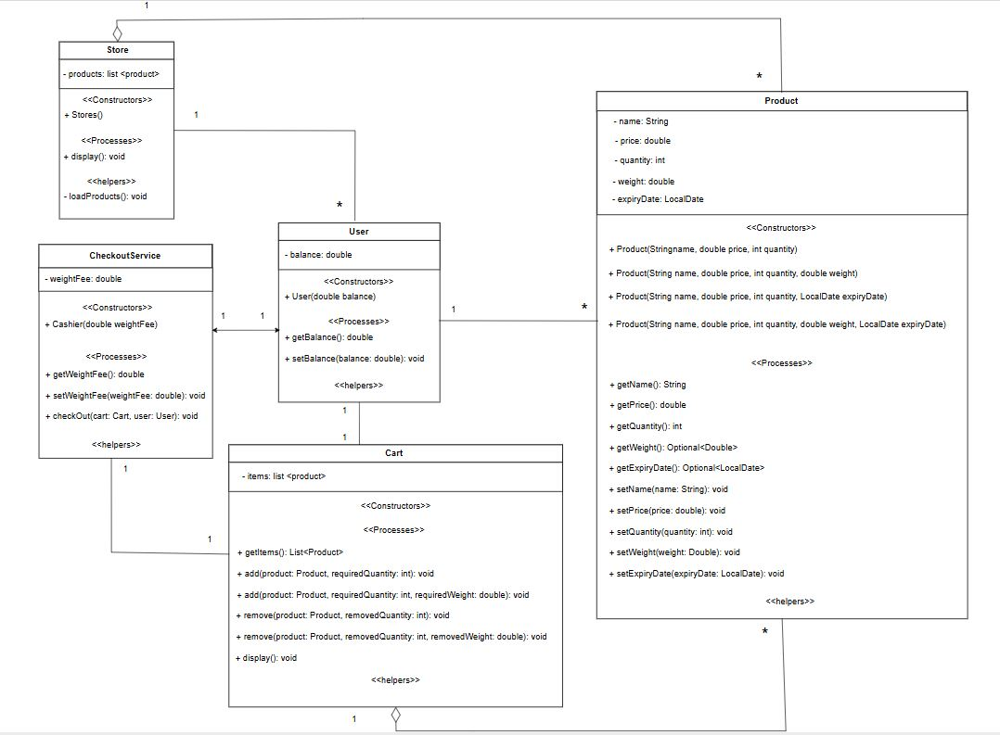
  </ul>
 

## 3. Cases:
  <ol>
     <li><b>Show Store:</b>  </li>  
     <b><li>Add Three Items:</b>  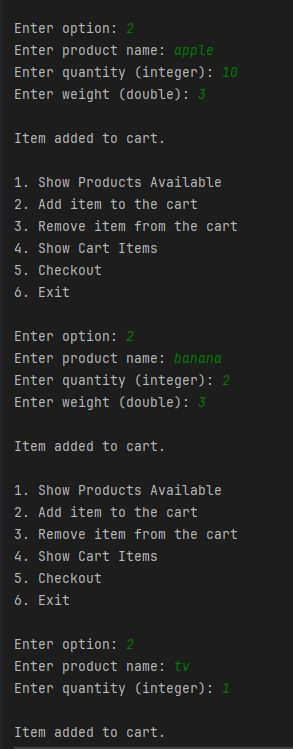 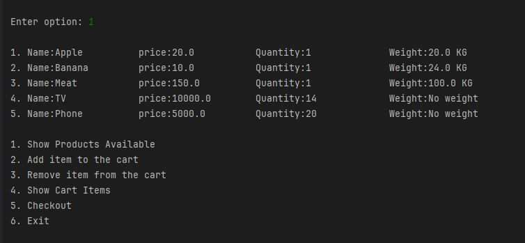 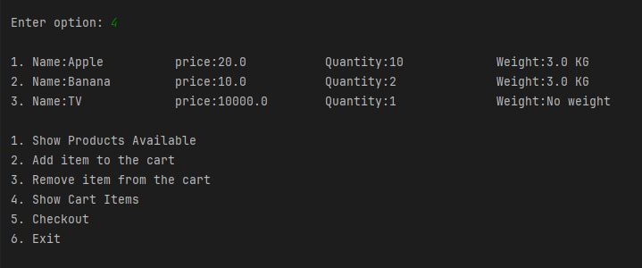</li>  
     <b><li>Remove An Item:</b>  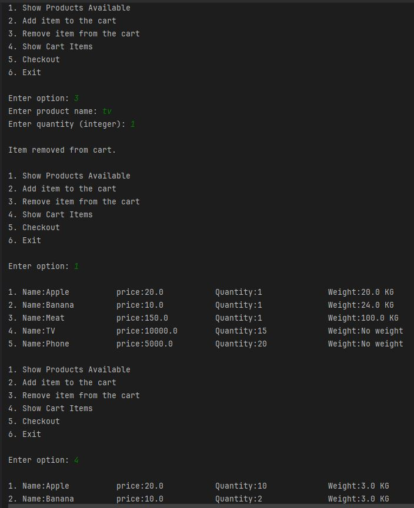</li>  
     <b><li>Adding Items More Than Available:</b>  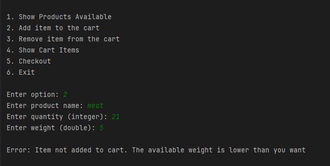</li>  
     <b><li>Remove Items Than Exist in Cart:</b>  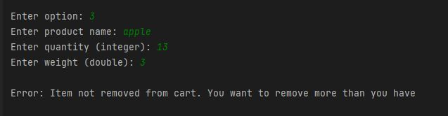</li>  
     <b><li>Add Non-Existing Item:</b>  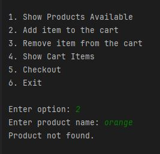</li>  
     <b><li>Add Wrong Weights & Quantity:</b>  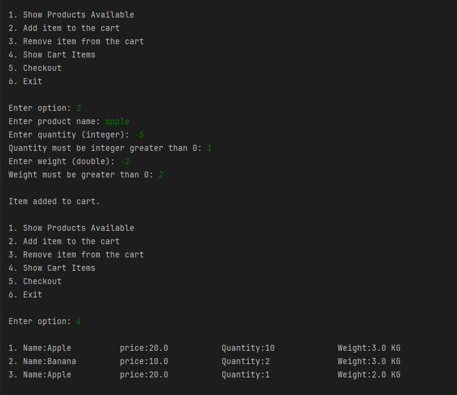</li>  
     <b><li>Correct Checkout:</b>  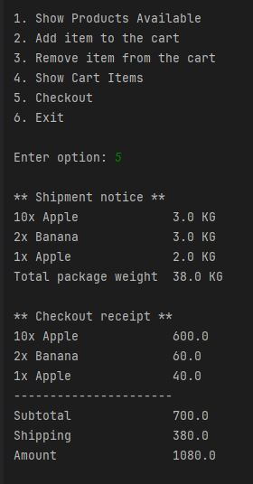</li>  
     <b><li>Checkout With Expired Date:</b>  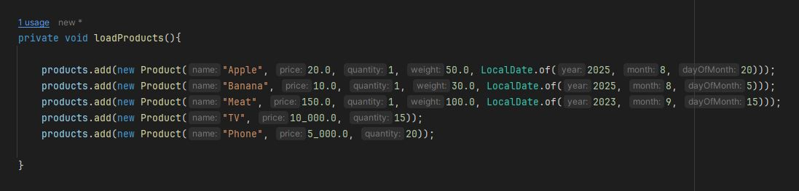 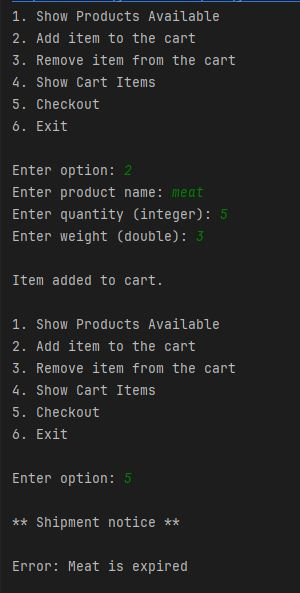</li>  
     <b><li>Checkout With Empty Cart:</b>  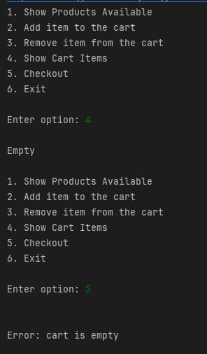</li>  
     <b><li>Checkout With Inefficient Balance:</b>  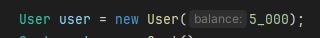  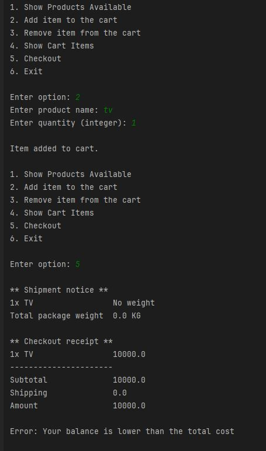</li>  
     <b><li>Adding Same Item Multiple Times:</b>  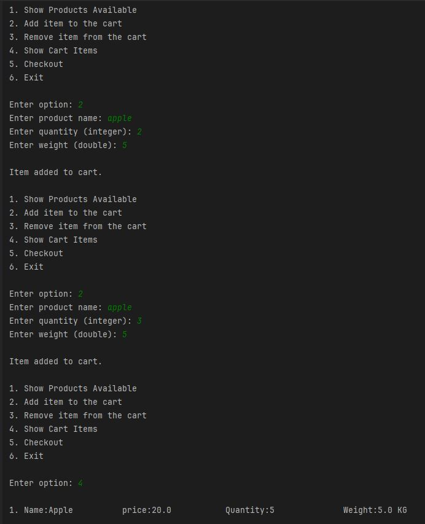</li> 
  </ol>
 

## 4. Notes:
 <ul>
     <b><li>The System may be more complicated such that having ID for products and having user information and even separate items and products in different classes, but I try to do as I can with the specifications mentioned</li></b>
  </ul>
